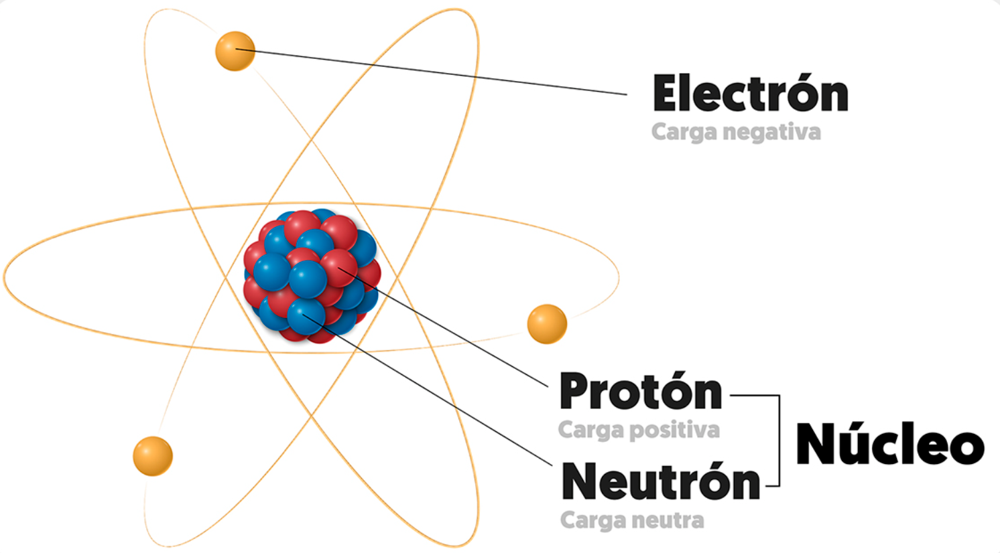
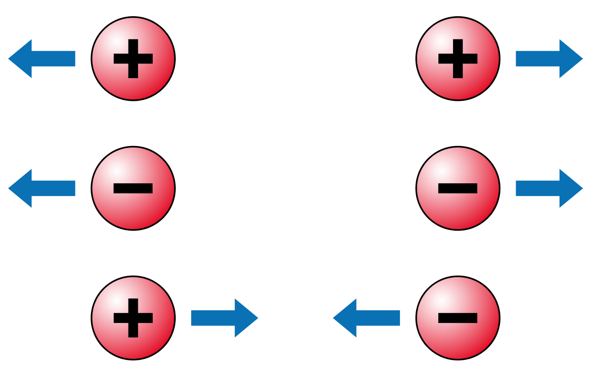

# 1. La estructura del átomo :simple-electron:

{ align=right width=300px }

Los fenómenos eléctricos tiene su origen en la **estructura interna de la materia**, que está formada por partículas diminutas llamadas **átomos**. Los átomos son los componentes básicos de toda la materia que nos rodea y determinan sus propiedades. Aunque parecen indivisibles a simple vista, los átomos están formados por dos **zonas** (núcleo y corteza) que albergan tres tipos de **partículas subatómicas**:

| ZONA | PARTÍCULA SUBATÓMICA |  |
| ------------ | ------------- | ------------ |
| NÚCLEO  | **Protones** (+)          | Se encuentra en el NÚCLEO del átomo y se conocen también como cargas POSITIVAS  |
| NÚCLEO  | **Neutrones** (sin carga) | Se encuentra en el NÚCLEO del átomo y se conocen también como cargas NEUTRAS    |
| CORTEZA  | **Electrones** (-) | Se encuentra en la CORTEZA del átomo y se conocen también como cargas NEGATIVAS    |

!!! note "Definición de Átomo"
    El **átomo** es el componente fundamental de la materia, y le proporciona sus propiedades

Vamos a estudiar con atención las partículas subatómicas constituyentes del átomo y la facultad de moverse que tienen los electrones.

## 1.1. Carga eléctrica: positiva y negativa

Las subpartículas que forman el átomo tienen distinta carga eléctrica:

- Los electrones tienen carga negativa (-).
- Los protones tienen carga positiva (+).
- Los neutrones no tienen carga.

Es importante saber que **dos cargas del mismo signo se repelen**. Por el contrario, **dos cargas de diferente signo se atraen**.

En estado normal cada átomo tiene el mismo número de protones que de electrones, por lo que, en este estado normal, se dice que es un **átomo neutro**.

Algunos átomos presentan tendencia a capturar o a perder electrones, lo que produce un desequilibrio de cargas.

- Si un átomo captura electrones queda cargado negativamente (**ión negativo**).
- En cambio, si pierde electrones, queda cargado positivamente (**ión positivo**).

## 1.2. Fuerzas de atracción y repulsión

Entre las **partículas subatómicas** (como protones, electrones y neutrones)  existen **fuerzas de atracción y repulsión**, y son las responsables de mantener un átomo unido. Vamos a verlo con más detalle, pero explicado de manera sencilla:

* **Protones (+) y protones (+)**:

    * Se repelen porque tienen la misma carga positiva.
  
        * Sin embargo, dentro del núcleo, esta repulsión es superada por otra fuerza (nuclear) que hace que los protones no se separen demasiado.

{ align=right width=200px }    

* **Electrones (-) y electrones (-)**:

    * También se repelen porque tienen la misma carga negativa.

* **Protones (+) y electrones (-)**:

    * Se atraen porque tienen cargas opuestas.

      * Esto mantiene a los electrones girando alrededor del núcleo del átomo, como si fueran atados a él.
