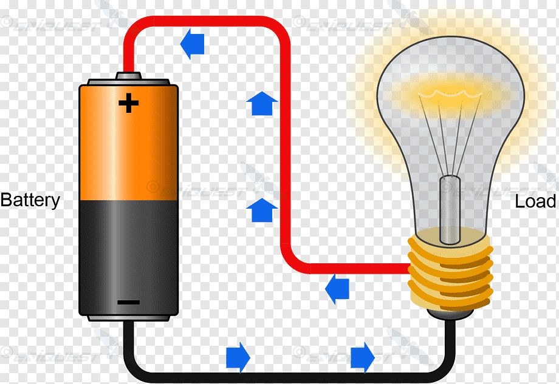

# 2. La corriente eléctrica ⚡

{ align=right width=300px }

Imagina que los átomos son como pequeñas piezas de un juego. Algunos de ellos tienen **carga positiva** (como si fueran imanes con un lado que "atrae") y otros tienen **carga negativa** (como el otro lado del imán que también "atrae").
Cuando un átomo con carga positiva se acerca a otro con carga negativa, la parte positiva atrae a los electrones (que tienen carga negativa) del otro átomo. Esto ocurre hasta que las dos cargas se equilibran y ya no hay atracción porque quedan "neutros", como si todo estuviera en calma.

En el caso de que estos saltos de los electrones sean **caóticos** o desordenados, **no habrá corriente eléctrica**.

{ align=right width=300px }

Ahora, si conseguimos que los electrones (que son muy pequeños y están en movimiento) empiecen a moverse de un átomo a otro en un **orden y dirección específica**, decimos que **sí hay una corriente eléctrica**.

Es como si los electrones fueran coches en una carretera, moviéndose todos en la misma dirección. Este movimiento ocurre dentro de ciertos materiales, como los **metales**. Por eso decimos que "circula corriente eléctrica" por un cable, aunque en realidad lo que se mueve son esos electrones, y lo hacen desde un extremo del cable hasta el otro de manera continua.

!!! note "Definición de Corriente Eléctrica"
    La **corriente eléctrica** es el movimiento ordenado de **electrones** a lo largo de un cuerpo en un mismo sentido.

## 2.1. Generadores eléctricos

{ align=right width=300px }

¿Quién es el responsable de que lo electrones se muevan en una misma dirección? Los electrones se mueven en la misma dirección porque son empujados por una fuerza especial que es generada por los **generadores eléctricos** (pila, baterías, dinamos...). 

Te lo explico de una forma sencilla: En un circuito eléctrico, los extremos del cable están conectados a un **generador**, como una pila o una batería. La batería tiene dos polos: uno positivo y uno negativo, realizando una fuerza que "empuja" a los electrones desde el polo negativo al polo positivo.

Es habitual oír que por un cable circula corriente eléctrica. Cuando se dice esto, nos referimos a que, por su interior, circulan electrones; es decir, los electrones se desplazan de manera continua, a través de él, de un extremo a otro.
