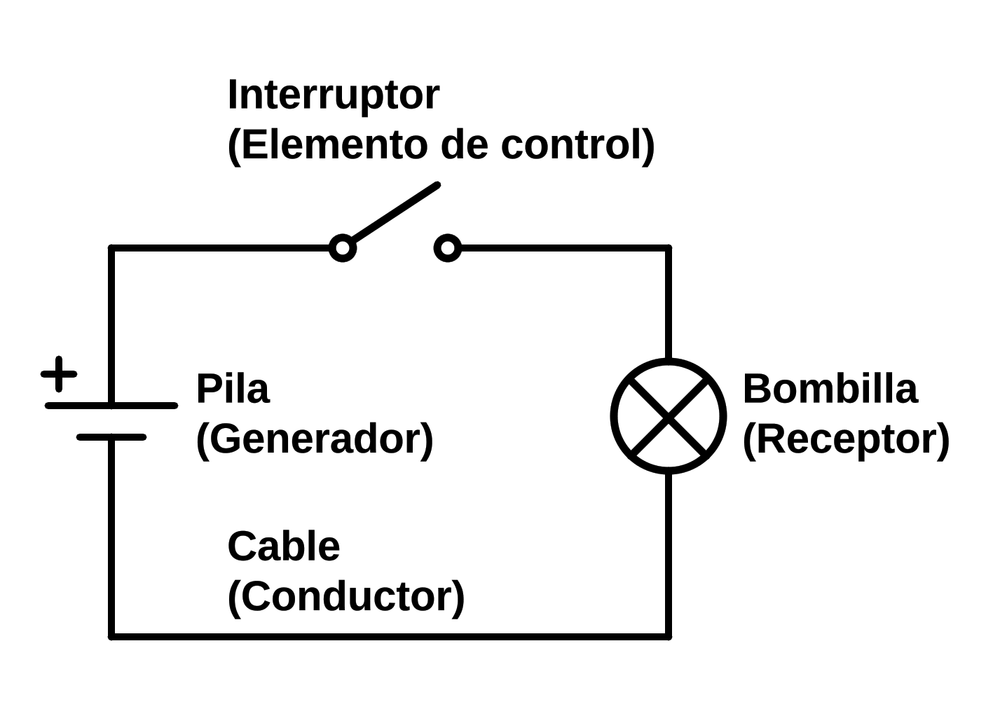

# 5. Símbolos y esquemas eléctricos

## 5.1. Símbolos eléctricos

Cuando queremos representar un circuito eléctrico en papel nos resultaría muy complicado dibujar cada componente eléctrico con su forma real. Para solucionar este problema y representar el circuito más rápida y fácilmente, cada componente eléctrico se representa por su **símbolo eléctrico** correspondiente.

Hay un símbolo por cada componente eléctrico correspondiente. Estos son los más importantes:

{ align=center width=100% }

## 5.2. Esquemas eléctricos

Una vez conocidos los símbolos eléctricos por separado podremos representar un circuito eléctrico con ellos. Esta representación sencilla del circuito se denomina **esquema eléctrico**

**Ejemplo**: Circuito formado por una pila, una bombilla y un interruptor.

{ align=center width=50% }